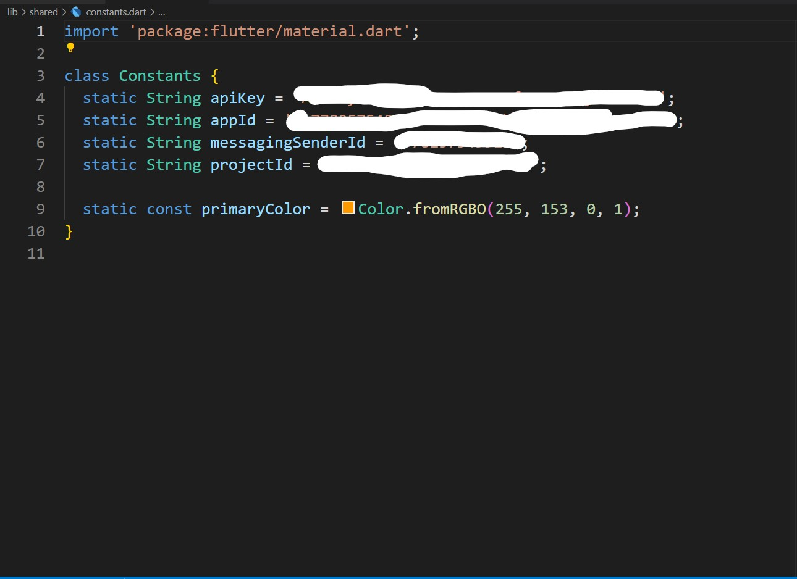

# talkrr_chat_app

Created By: Sharma Naresh Ashok

Project name: Talkrr Chat App

Description: 
    This is a simple chat app named 'Talkrr' created with the purpose to bring people together. Using this app people can create groups which can be joined by multiple people to talk or share ideas or just to chill out.

    Some of the features of this app:
        - Sign up on the app
        - Login on the app
        - User can create groups
        - Groups can be joined by other users signed up on this app
        - Users can search groups
        - Can join and leave the groups
        - Can chat with other users in groups

---------------------------------------------------------------------------------------------------------------------------------------

## Getting Started

This project is a starting point for a Flutter application.

A few resources to get you started if this is your first Flutter project:

- [Lab: Write your first Flutter app](https://docs.flutter.dev/get-started/codelab)
- [Cookbook: Useful Flutter samples](https://docs.flutter.dev/cookbook)

For help getting started with Flutter development, view the
[online documentation](https://docs.flutter.dev/), which offers tutorials,
samples, guidance on mobile development, and a full API reference.

---------------------------------------------------------------------------------------------------------------------------------------

### PLEASE READ THIS BEFORE CLONING AND RUNNING THIS PROJECT

To run this project you will need Firebase API keys as this project used Firebase as backend. To know more about how to add firebase to your flutter projects, just follow these: 
    - [Android: Add Firebase to your flutter project](https://firebase.google.com/docs/flutter/setup?platform=android)
    - [IOS: Add Firebase to your flutter project](https://firebase.google.com/docs/flutter/setup?platform=ios)
    - [Youtube search: How to add firebase to flutter app](https://www.youtube.com/results?search_query=how+to+add+firebase+to+flutter+app)

I had created constants.dart file in lib/shared/ folder which contains my firebase web app configuration keys and to protect that sensitive data, I have removed it from my git repo. Thus, any calls to Constants.dart file won't work.

However, if you are want to know my constant.dart file structure, here's one image to help you:

